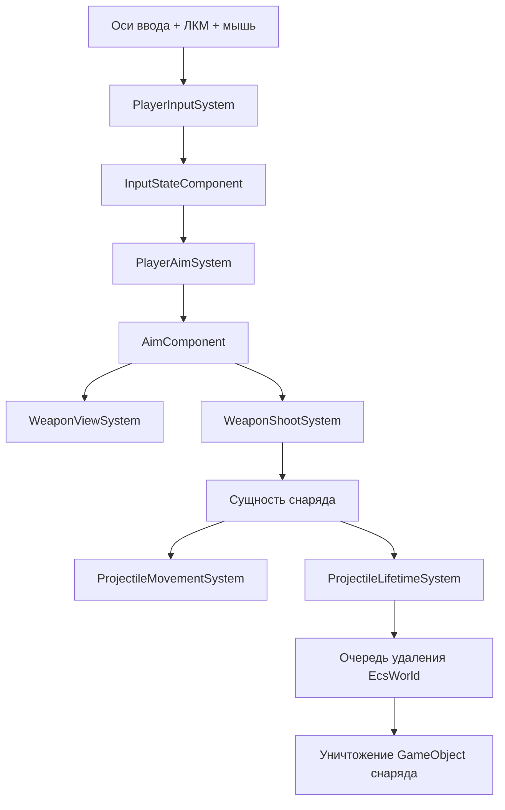

# Поток боя игрока

Документ описывает реальный путь от ввода игрока до очистки снаряда.

Связанные документы: [Цикл выполнения](runtime-loop.md), [Компоненты ECS](../models/ecs-components.md), [Обработка ошибок](../errors/error-handling.md).

## Пошаговый поток
1. `PlayerInputSystem` читает оси клавиатуры (`Horizontal`, `Vertical`), позицию и состояние мыши.
2. `PlayerAimSystem` вычисляет нормализованный вектор прицеливания от игрока к курсору.
3. **`WeaponViewSystem`** (рендер-слой, после симуляции выстрелов в цепочке Update): включает `SpriteRenderer` на объекте **WeaponView** (дочерний к игроку, один `GameObject` со спрайтом), подставляет спрайт/сортинг/масштаб из `EquippedWeaponComponent`, позиционирует оружие в **пространстве прицела** по **`MuzzleOffset`** (+ для melee добавочное смещение из **`MeleeWeaponPose`**), поворачивает по углу прицела, `WeaponVisualBaseRotationDeg` и фазе melee, применяет **`WeaponVisualMirrorX` / `WeaponVisualMirrorY`** и политику `flipY` для melee при необходимости. Ось вращения на текстуре задаётся **пивотом спрайта** в Sprite Editor, отдельного ECS-поля для «grip offset» нет.
4. **`WeaponShootSystem`** (только archetype **без** shotgun/laser/melee тегов): ЛКМ + cooldown → сущность снаряда. Для **Shotgun** / **Laser** / **Melee** работают свои системы (`ShotgunShootSystem`, `LaserBeamSystem`, **`MeleeAttackSystem`**).
5. `ProjectileMovementSystem` двигает снаряд каждый физический тик.
6. `ProjectileLifetimeSystem` уменьшает время жизни и помечает сущность снаряда на удаление.
7. `EcsWorld` во время flush удаляет сущность и уничтожает связанный GameObject.

В том же кадре **до** `WeaponViewSystem` в Update уже отработали: подбор (`WeaponPickupSystem`), стрельба по виду оружия, **melee** (фазы атаки и overlap-попадания), снаряды/лучи, отдача по `ShotEvent`. Затем визуал оружия, вспышка, луч, анимация персонажа. Порядок см. [Цикл выполнения](runtime-loop.md) и [ARCHITECTURE_AUDIT.md](../ARCHITECTURE_AUDIT.md). Практическая настройка полей — [Гайд: оружие](../gides/add_weapon.md).

## Диаграмма потока данных

## Важные связности
- Скорострельность: `WeaponCooldownComponent.CooldownRemaining` уменьшается на `deltaTime` в системах стрельбы — **без** опоры на `Time.time` (см. комментарий в `CombatComponents.cs`).
- Прицеливание зависит от `Camera.main`; отсутствие правильно помеченной камеры отключает путь ввода.
- Визуал снарядов создается динамически; пул объектов пока не реализован.

Для зависимостей от движка и настроек см. [Конфигурация](../config/configuration.md). Для контроля качества см. [Стратегия тестирования](../testing/testing-strategy.md).
